# Bank Observability Platform — How It Works

> **What this document is:** everything about this project in one place — what it
> is, why it exists, how each piece works, what has been built so far, and what
> is left. Written to be read top to bottom, with diagrams instead of walls of
> text.

---

## Table of contents

1. [The 30-second version](#1-the-30-second-version)
2. [The problem we are solving](#2-the-problem-we-are-solving)
3. [The big picture](#3-the-big-picture)
4. [Why there are two pipelines](#4-why-there-are-two-pipelines)
5. [The five modules](#5-the-five-modules)
6. [Life of a single log](#6-life-of-a-single-log)
7. [Inside the SDK](#7-inside-the-sdk-observability-starter)
8. [Inside the Logging API](#8-inside-the-logging-api)
9. [The database](#9-the-database)
10. [Configuration](#10-configuration)
11. [Plugging in a real microservice](#11-plugging-in-a-real-microservice)
12. [The build journey](#12-the-build-journey)
13. [Where we are now](#13-where-we-are-now)
14. [What is left](#14-what-is-left)
15. [Running it locally](#15-running-it-locally)
16. [Design decisions and why](#16-design-decisions-and-why)

---

## 1. The 30-second version

**This is not a banking application.** It is a *reusable logging platform* that
every banking microservice — Accounts, Payments, Cards, UPI, CBS — imports as a
single Maven dependency.

A developer writes **one line**:

```java
commonLogger.logApplication("Balance fetched successfully",
        Map.of("channel", "MOBILE", "module", "BALANCE"));
```

The platform automatically attaches *who, where, when and which journey*, hides
anything sensitive, and stores it in two places so it can be both **searched
live** and **looked up months later by trace ID**.

```json
{
  "traceId":     "a4f1c9e2-...",     ← added automatically
  "bankCode":    "NPST",             ← added automatically
  "environment": "DEV",              ← added automatically
  "service":     "sample-bank-app",  ← added automatically
  "timestamp":   "2026-09-08T17:04:08.147Z",  ← added automatically
  "level":       "INFO",
  "message":     "Balance fetched successfully",
  "metadata":    { "channel": "MOBILE", "module": "BALANCE" }
}
```

The developer never types `bankCode` or `service`. That is the whole point.

---

## 2. The problem we are solving

### A real customer journey

A customer opens the Bharat Bank mobile app and taps **Check Balance**.

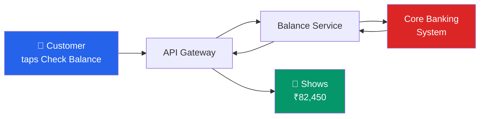

That took **four network hops across three systems**, and it worked.

Now suppose it *didn't* — the customer calls support saying "my balance won't
load". Without this platform, the support engineer has to:

- guess which of eight microservices failed,
- SSH into each one,
- grep log files that use different formats,
- and hope the logs haven't rotated away.

### What the platform gives them instead

One search, by **trace ID**, returns the entire journey across every service:

| time | service | level | message |
|---|---|---|---|
| 17:04:08.147 | api-gateway | INFO | Request received |
| 17:04:08.201 | balance-service | INFO | Fetching balance from CBS |
| 17:04:09.883 | balance-service | **WARN** | CBS slow: 1682ms |
| 17:04:09.891 | balance-service | **ERROR** | CBS timeout, returning cached |

The answer is visible in seconds. **That** is what we are building — a *system
diary* for the whole bank.

---

## 3. The big picture

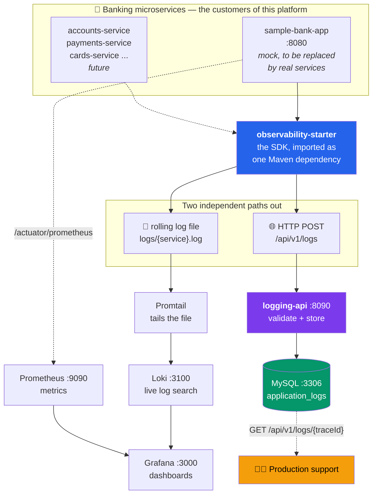

---

## 4. Why there are two pipelines

This is the single most important design idea, and it is easy to miss.

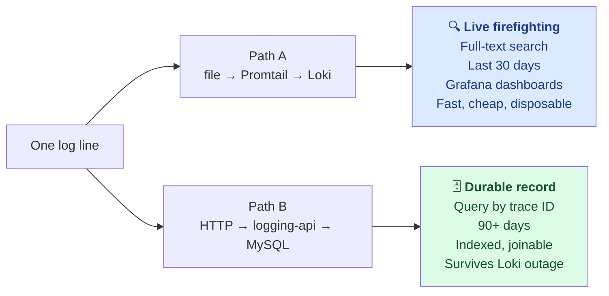

| | **Loki (Path A)** | **MySQL (Path B)** |
|---|---|---|
| Best at | scanning millions of lines fast | pinpointing one journey |
| Used by | engineers during an incident | support desk, weeks later |
| Retention | 30 days | 90 days |
| If it dies | the other still works | the other still works |

**They are deliberately independent.** Promtail reads a file on disk, so even if
`logging-api` and MySQL are both down, logs still reach Grafana. And if Loki is
down, MySQL still has the durable record. Neither can take the other with it.

---

## 5. The five modules

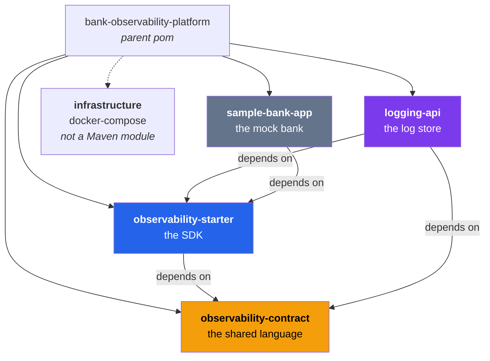

| Module | What it is | Think of it as |
|---|---|---|
| **observability-contract** | 5 plain Java classes, no Spring | The *dictionary* both sides agree on |
| **observability-starter** | The SDK every service imports | The *pen* that writes the diary |
| **sample-bank-app** | Fake bank, to be swapped for real services | The *test subject* |
| **logging-api** | Receives, validates, stores | The *filing cabinet* |
| **infrastructure** | Docker Compose + configs | The *building* it all runs in |

### Why a separate `contract` module?

Before it existed, the SDK serialised its internal object straight onto the
network, and `logging-api` validated a *different* class. They matched only by
luck — and at one point **didn't**: the SDK sent `serviceName`, the API demanded
`service`, so **every single log was rejected**. Nobody noticed, because the
failure was silently swallowed.

Now there is exactly one definition, used by both sides. That class of bug is
structurally impossible.

---

## 6. Life of a single log

Follow one line from a developer's keyboard to the database.

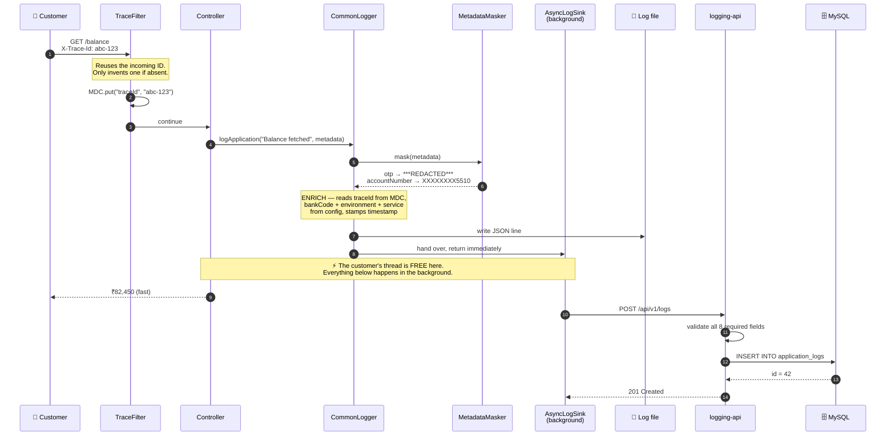

**The critical moment is step 10.** The customer gets their balance *before*
anything touches the network or the database. Logging can be slow, or down, and
the customer never knows.

---

## 7. Inside the SDK (`observability-starter`)

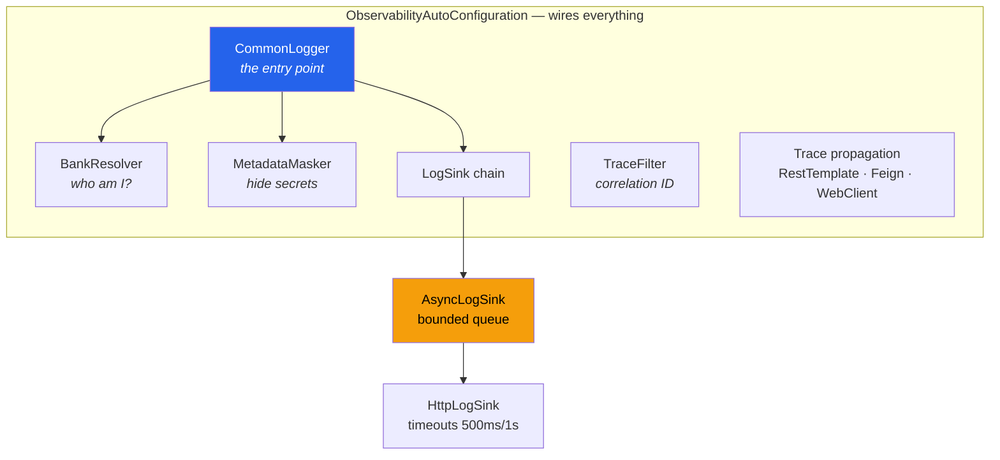

### 7.1 `CommonLogger` — the only thing developers touch

```java
public interface CommonLogger {
    void logApplication(String message, Map<String, Object> metadata);
    void logApplication(LogLevel level, String message, Map<String, Object> metadata);
    void audit(String actorId, String actorType, AuditAction action,
               String entity, String entityId, String description);
    void error(String message, Exception cause);
}
```

The `level` overload matters more than it looks. Originally *everything* was
hardcoded to `INFO` — which made the planned "search by level" feature
meaningless, because every row would say `INFO`. A rejected transfer is a
**WARN**, and support filters on exactly that.

### 7.2 Auto-configuration — why the SDK is genuinely reusable

This is the fix that makes the whole project work.

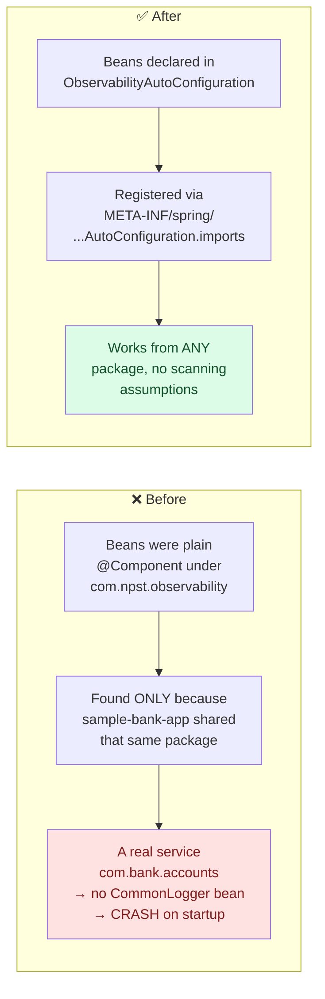

The platform *appeared* to work while being unusable by any real service. There
is now a permanent guard: **`ForeignPackageStarterTest` lives in
`com.example.foreignbank`** — a package with no relationship to the SDK — and
boots it successfully. If that test ever fails, reusability has broken.

Every bean is `@ConditionalOnMissingBean`, so a service can replace any single
piece without forking. The whole thing switches off with
`observability.enabled: false`.

### 7.3 Trace ID — stitching services together

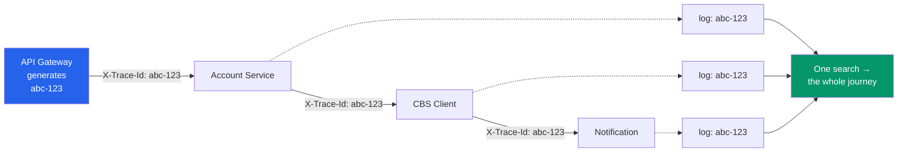

- **`TraceFilter`** reads the incoming `X-Trace-Id` header and only invents one
  if it is absent. Runs first in the filter chain, so nothing is ever logged
  without it.
- **Propagation out** is automatic for `RestTemplate`, **Feign** and
  **WebClient** — so when the real services adopt OpenFeign, traces survive the
  first hop with zero extra code.
- It uses **MDC** (a per-thread map), and removes *only its own key* at the end.
  The old code called `MDC.clear()`, which also wiped keys the host application
  had set for its own logging.

### 7.4 Masking — the OTP gate

Metadata is a free-form map, so nothing stops a developer writing
`Map.of("otp", "483920")`. The PRD's Security NFR forbids exactly that.

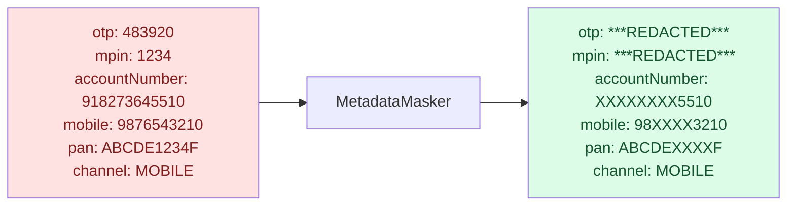

Two categories:

- **Redacted entirely** — `otp`, `mpin`, `tpin`, `password`, `token`, `cvv`,
  `biometric`… No diagnostic value, real regulatory consequences if leaked.
- **Partially masked** — `accountNumber`, `cardNumber`, `pan`, `aadhaar`,
  `mobile`, `email`. Enough for support to match the customer on the phone, not
  enough to reuse the instrument.

Three details that matter:

1. **Masking happens *before the line is written anywhere*** — not just before
   sending. The file is tailed straight into Loki, so an unmasked OTP on disk
   has *already* leaked.
2. **It recurses** into nested maps and lists. A beneficiary block one level
   down would otherwise leak everything.
3. **Matching is exact**, on the key lower-cased with `_` and `-` removed. So
   `accountNumber`, `account_number` and `ACCOUNT-NUMBER` all match — but `pin`
   does *not* swallow `shipping`.

### 7.5 The sink chain — why logging can never hurt the bank

This is the most safety-critical part of the platform.

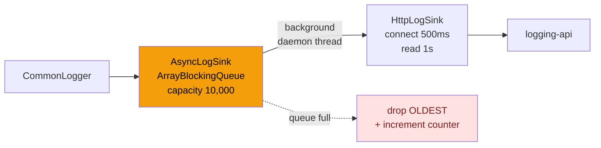

| Decision | Why |
|---|---|
| **Bounded queue** | Unbounded would turn a `logging-api` outage into an **OutOfMemoryError in the banking service** — the observability tool killing the thing it observes |
| **Drop oldest, never block** | Blocking would reintroduce the exact latency the queue exists to remove. Newest lines are what an engineer is looking at during an incident |
| **Every drop counted** | `observability_logs_dropped_total` climbing is the signal. Silent loss is still *visible* loss |
| **Hard timeouts** | The original `RestTemplate` had **none** — a stalled `logging-api` would block bank request threads forever |
| **Failures logged, not swallowed** | The original `catch (Exception ignored) {}` meant a rejected log looked identical to a delivered one |

**Proven at runtime.** With `logging-api` completely killed:

```
req 1: 200 in 0.005639s      submitted_total  8.0
req 2: 200 in 0.008266s      sent_total       3.0
req 3: 200 in 0.006177s      failed_total     5.0
req 4: 200 in 0.006312s      dropped_total    0.0
req 5: 200 in 0.007171s
```

The bank app kept answering in **5–8 ms** with the platform entirely down, and
every failure was counted and logged with its trace ID.

---

## 8. Inside the Logging API

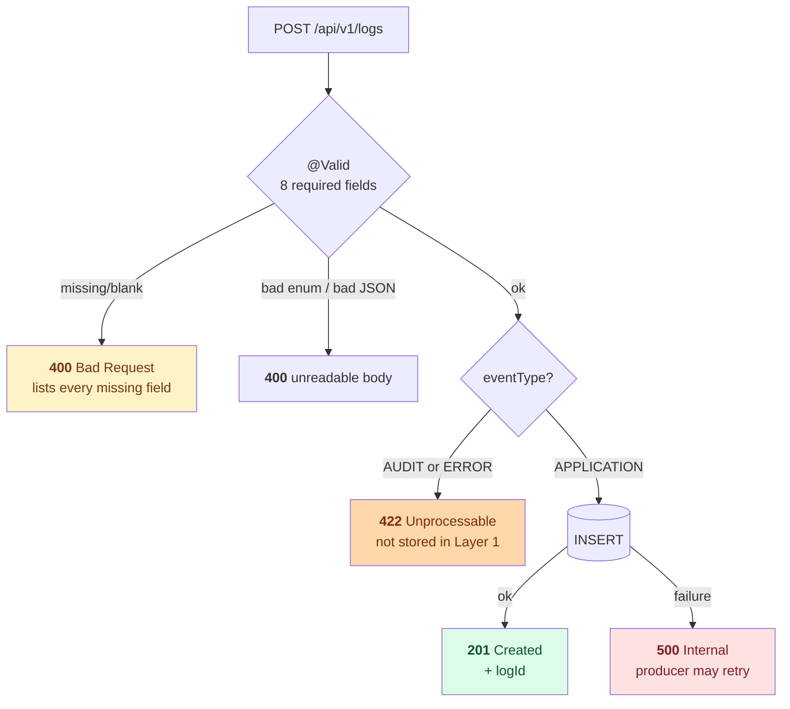

Status codes are chosen to **tell the producer what to do**:

| Code | Meaning | Producer should |
|---|---|---|
| 201 | Stored | nothing |
| 400 | Malformed | fix the code — retrying won't help |
| 422 | Valid, but wrong layer | fix configuration |
| 500 | Our fault | retry |

Every response uses the same envelope, including the trace ID:

```json
{
  "status":  "ERROR",
  "message": "Log rejected: validation failed",
  "traceId": "TRACE-002",
  "errors": [
    "bankCode: bankCode is required",
    "environment: environment is required",
    "service: service is required"
  ],
  "timestamp": "2026-09-08T17:04:08.147Z"
}
```

> That example is **the exact bug this project started with** — the SDK wasn't
> enriching those three fields, so every log was rejected by a response that
> named none of them. It is now a passing regression test.

---

## 9. The database

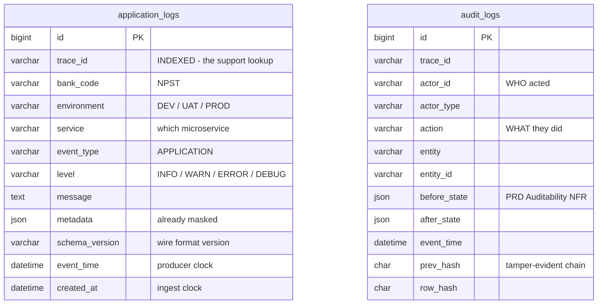

### Two tables, on purpose

Audit is **not** "application logs with a different `event_type`". It answers
*who did what*, is read by compliance rather than support, and has a retention
obligation measured in **years** rather than days. Mixing them makes both harder
to secure and to purge.

### `audit_logs` is immutable — enforced by the database

```sql
CREATE TRIGGER audit_logs_block_update
    BEFORE UPDATE ON audit_logs
    FOR EACH ROW
    SIGNAL SQLSTATE '45000'
        SET MESSAGE_TEXT = 'audit_logs is append-only: UPDATE is not permitted';
```

Plus the same for `DELETE`, and a `prev_hash`/`row_hash` chain so tampering is
detectable even by someone who drops the triggers.

Immutability by *convention* is not immutability. A trigger survives an
application bug, a careless migration, and an operator at a MySQL prompt.

> **Layer 1 writes nothing to `audit_logs`.** The table exists now so that
> turning audit on later is a feature flag, not a schema migration against a
> live log store.

### Two timestamps, not one

`event_time` is the producer's clock; `created_at` is stamped on arrival. Clocks
across microservices are never perfectly aligned — keeping both is what makes a
trace readable when one service has drifted.

### Indexes

Five, covering every access path: `trace_id`, `(service, created_at)`,
`(level, created_at)`, `(bank_code, created_at)`, `created_at`. Without them
every support lookup is a full scan of a table growing at request rate.

### Flyway owns the schema

`ddl-auto` is **`validate`**, not `update`. Previously the table existed only
because Hibernate happened to create it on someone's laptop — no review, no
history, no guarantee two environments matched. Now schema drift is a **startup
failure**, not a silent runtime surprise.

---

## 10. Configuration

Everything lives under one `observability.*` prefix. A new microservice needs
**three lines**:

```yaml
observability:
  environment: DEV
  bank:
    code: NPST
  sink:
    endpoint: http://logging-api:8090/api/v1/logs
```

Note what is **absent**: `service`. It defaults to `spring.application.name`, so
a service names itself once.

<details>
<summary><b>Full reference</b> (click to expand)</summary>

```yaml
observability:
  enabled: true                    # master switch — false contributes no beans
  environment: DEV                 # DEV / UAT / PROD
  service:                         # defaults to spring.application.name

  bank:
    code: NPST
    name: Bharat Bank
    region: IN

  sink:
    enabled: true                  # false = file/Loki only, no HTTP
    endpoint: http://localhost:8090/api/v1/logs
    connect-timeout: 500ms
    read-timeout: 1s
    async:
      enabled: true                # false = ship inline (tests only)
      queue-capacity: 10000
      workers: 1
      shutdown-timeout: 5s

  trace:
    header: X-Trace-Id
    mdc-key: traceId

  masking:
    enabled: true
    placeholder: "***REDACTED***"
    redact-keys: [otp, mpin, tpin, pin, password, token, cvv, ...]
    mask-keys:   [accountNumber, cardNumber, pan, aadhaar, mobile, email, ...]

  exception-handler:
    enabled: false                 # opt-in; off so the SDK never swallows
                                   # the host application's error handling
```

</details>

All identity values are environment-variable overridable
(`OBSERVABILITY_BANK_CODE`, `OBSERVABILITY_ENVIRONMENT`,
`OBSERVABILITY_LOGGING_ENDPOINT`), so the **same JAR** runs in every
environment.

---

## 11. Plugging in a real microservice

The promise: replacing `sample-bank-app` with a real service is a **dependency
plus three YAML lines**.

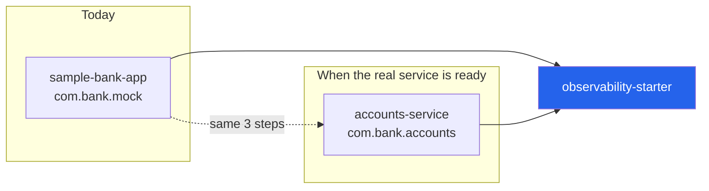

**Step 1** — add the dependency:

```xml
<dependency>
    <groupId>com.npst.observability</groupId>
    <artifactId>observability-starter</artifactId>
    <version>1.0.0-SNAPSHOT</version>
</dependency>
```

**Step 2** — add the three YAML lines from §10.

**Step 3** — inject and use it:

```java
@RestController
public class BalanceController {

    private final CommonLogger commonLogger;   // just inject it

    @GetMapping("/api/v1/accounts/{id}/balance")
    public BalanceResponse balance(@PathVariable String id) {
        commonLogger.logApplication("Balance fetched successfully",
                Map.of("channel", "MOBILE", "module", "BALANCE"));
        return ...;
    }
}
```

There is **no step 4**. No trace ID plumbing, no bank code, no service name, no
masking calls, no HTTP client. The service's package name is irrelevant.

---

## 12. The build journey

### Where the project actually stood at the start

An audit of the existing code found **84 gaps**, of which 12 were blockers. The
most serious:

> **`main` did not compile.** The commit was titled *"complete Layer 1
> application logging foundation"*, but `CommonLoggerImpl` called
> `setBankCode()`, `setEnvironment()` and `getServiceName()` — three methods
> that had never been written. Stale `.class` files in `target/` made it look
> like it worked.

Others: the SDK was unusable outside its own package; the HTTP client had no
timeout; every failure was silently swallowed; the schema existed only because
`ddl-auto: update` created it on a laptop; `MaskingUtil` was written but never
called; no search APIs existed at all; and the same log file was being written
by multiple JVMs at once.

### The eight-step plan

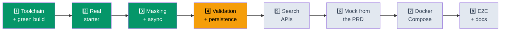

### What each step did

| # | Step | What changed | Status |
|---|---|---|---|
| **1** | **Toolchain + green build** | Installed JDK 21; enforcer plugin fails loudly on the wrong JDK; fixed the 4 compile errors; retired `audit-service`; `errorResponse` → `ErrorResponse` with the getters Jackson needs | ✅ `811dd54` |
| **2** | **Real Spring Boot starter** | All beans moved to auto-configuration; created `observability-contract`; collapsed 3 config models into one `observability.*` tree; stopped publishing a `RestTemplate` bean that hijacked the host app's | ✅ `f269896` |
| **3** | **Masking + async transport** | `MetadataMasker`; `LogSink` → `AsyncLogSink` → `HttpLogSink`; Micrometer counters; Feign + WebClient propagation; per-service rolling log files | ✅ `f32c6de` |
| **4** | **Validation + persistence** | `logging-api` consumes the contract; full exception advice; Flyway `V1` + `V2`; `ddl-auto: validate`; actuator on the log service | 🟡 code done, DB unverified |
| **5** | Search APIs | `GET /logs/{traceId}` and filtered/paged search | ⬜ not started |
| **6** | Mock from the PRD | Balance, Summary, Statement, Beneficiary+OTP, IMPS transfer | ⬜ not started |
| **7** | Docker Compose | Dockerfiles, volumes, Promtail JSON labels, Grafana as code | ⬜ not started |
| **8** | End-to-end + docs | The 5-point M5 gate, Testcontainers, `INTEGRATION.md` | ⬜ not started |

### A bug worth remembering

During Step 3 the build was green and every test passed — but a runtime check
showed `observability_logs_submitted_total` missing and the first request taking
**333 ms**.

`HttpLogSink` **is a** `LogSink`. So `@ConditionalOnMissingBean(LogSink.class)`
on the async wrapper *matched the HTTP sink* and silently skipped the wrapper.
Every log was still shipping inline on the customer's thread — the exact risk
the async sink exists to remove.

**Lesson: a green build is not proof.** There is now a regression test pinning
it, and every step since ends with a live runtime check, not just `mvn test`.

---

## 13. Where we are now

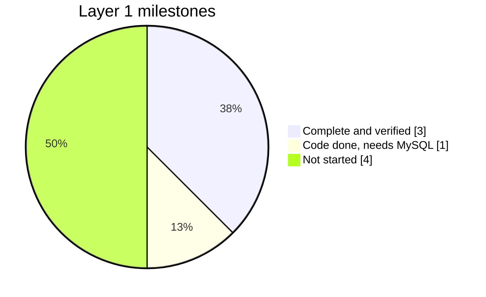

### Milestones

| Milestone | Status | Evidence |
|---|---|---|
| **M1 — Metadata enrichment** | ✅ **Done** | Live capture shows all 8 fields auto-populated |
| **M2 — API validation** | ✅ **Done** | 7 tests: 400 / 422 / 500 paths all covered |
| **M3 — MySQL persistence** | 🟡 **Written** | Flyway migrations written; needs a running MySQL |
| **M4 — Search APIs** | ⬜ Not started | Step 5 |
| **M5 — End-to-end** | ⬜ Not started | Step 8 |

### Test coverage today — **29 passing**

| Suite | Tests | Guards |
|---|---|---|
| `ForeignPackageStarterTest` | 4 | The SDK boots from an unrelated package |
| `ObservabilityAutoConfigurationTest` | 6 | Beans override-able; async actually wired |
| `MetadataMaskerTest` | 8 | OTPs never leak; `pin` ≠ `shipping` |
| `AsyncLogSinkTest` | 4 | Never blocks; bounded; drops counted |
| `LoggingControllerTest` | 7 | Every validation and error path |

### Verified live, not just in tests

- A request with `X-Trace-Id` produces a fully enriched log, and the header is
  echoed back and propagated onward.
- The exact JSON payload on the wire was captured and inspected.
- With `logging-api` killed, the bank app answered in **5–8 ms**, failures
  counted.
- Audit events reach the file but **not** the wire — Layer 1 scoping holds.

### Environment

| | |
|---|---|
| Java | ✅ Temurin **21.0.12.1 LTS** |
| Maven build | ✅ `BUILD SUCCESS`, 29 tests |
| Docker Desktop | ✅ installed (4.90.0), ❌ **engine not running** |
| **Blocker** | **WSL2 is not installed** — Windows 11 Home has no Hyper-V, so WSL2 is the only backend. Fix: `wsl --install --no-distribution` as Administrator, then reboot |

---

## 14. What is left

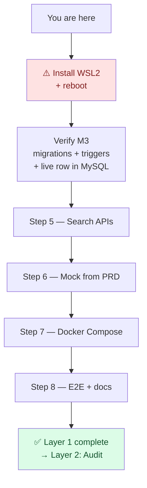

### Immediate

1. **Install WSL2 and reboot** — the only thing blocking progress.
2. **Verify Milestone 3** — the one thing I'd bet against is Hibernate's
   `validate` accepting the `Map<String,Object>` ↔ MySQL `json` mapping. If it
   complains, it's a one-line fix.

### Then, in order

- **Step 5** — `GET /api/v1/logs/{traceId}` returning the *whole* journey as a
  list, plus filtered and paged search.
- **Step 6** — rebuild the mock from the PRD: Balance (`₹82,450`), Account
  Summary (US-07), Statement (US-08), Beneficiary with OTP (US-09 — the live
  masking proof), IMPS transfer (US-10 — drives INFO/WARN/ERROR).
- **Step 7** — Dockerfiles; **volumes for Loki, Grafana and Prometheus** (all
  three currently lose everything on recreate); Promtail JSON parsing so
  `bankCode`/`service`/`level` become Loki labels; Grafana dashboards as code.
- **Step 8** — the five-point M5 gate, Testcontainers, `INTEGRATION.md`.

### Explicitly **not** being built yet

Audit persistence · Error persistence · Kafka · Elasticsearch · OpenTelemetry
redesign · Authentication/RBAC · Notifications.

---

## 15. Running it locally

### Prerequisites

```bash
java -version     # must be 21.x
docker ps         # must return a table, not an error
```

### Build

```bash
mvn clean install
```

### Start infrastructure

```bash
cd infrastructure
docker compose up -d
```

| Service | URL |
|---|---|
| Grafana | http://localhost:3000 |
| Prometheus | http://localhost:9090 |
| Loki | http://localhost:3100 |
| MySQL | `localhost:3306` — db `observability`, user `npst` |

### Start the services

```bash
java -jar logging-api/target/logging-api-1.0.0-SNAPSHOT.jar        # :8090
java -jar sample-bank-app/target/sample-bank-app-1.0.0-SNAPSHOT.jar # :8080
```

### Generate a log

```bash
curl -H "X-Trace-Id: MY-TEST-001" http://localhost:8080/api/v1/hello
```

### See it in all three places

```bash
# 1. The file
cat logs/sample-bank-app.log

# 2. Pipeline health
curl -s localhost:8080/actuator/prometheus | grep observability_logs

# 3. Grafana → Explore → Loki → {service="sample-bank-app"}
```

---

## 16. Design decisions and why

| Decision | Alternative rejected | Why |
|---|---|---|
| **Two independent pipelines** | One path only | Either can fail without taking the other down; they serve different jobs |
| **Async bounded queue** | Synchronous send | Logging must never add latency to — or fail — a customer transaction |
| **Drop oldest on overflow** | Block, or grow unbounded | Blocking reintroduces latency; unbounded is an OOM in the banking service |
| **Mask at the source** | Mask centrally at a processor | There is no processing stage between Promtail and Loki — an unmasked OTP on disk has already leaked |
| **Exact key matching** | Substring matching | `pin` would swallow `shipping` |
| **Separate contract module** | Serialise the internal object | One definition makes the `serviceName`/`service` bug structurally impossible |
| **Auto-configuration** | `@Component` scanning | The SDK must work from any package, or it is not reusable |
| **No `RestTemplate` bean** | Publishing one | A library must not silently claim the host application's client |
| **Opt-in exception handler** | Always on | A starter must not swallow the host application's error handling |
| **Flyway + `validate`** | `ddl-auto: update` | A bank's log schema is not something Hibernate should invent at startup |
| **Separate `audit_logs`** | One table, different `event_type` | Different readers, different retention, different security posture |
| **DB triggers for immutability** | Application-level rule | A trigger survives a bug, a migration, and an operator at a prompt |
| **`traceId` NOT a Loki label** | Label everything | Unbounded label cardinality destroys Loki; filter on the line instead |
| **Per-service log files** | One shared file | Two JVMs appending to one file interleave and corrupt lines |

---

## Appendix — file map

<details>
<summary><b>Every file and what it does</b> (click to expand)</summary>

### `observability-contract` — the shared language
| File | Purpose |
|---|---|
| `LogIngestRequest` | The wire payload. One definition, both sides |
| `ApiResponse<T>` | Standard envelope with `traceId` |
| `LogIngestResponse` | Success body carrying `logId` |
| `LogLevel` / `EventType` | Shared enums |

### `observability-starter` — the SDK
| File | Purpose |
|---|---|
| `CommonLogger` / `CommonLoggerImpl` | The entry point + enrichment |
| `ObservabilityAutoConfiguration` | Wires everything; makes it reusable |
| `ObservabilityFeignAutoConfiguration` | Trace propagation over Feign |
| `ObservabilityWebClientAutoConfiguration` | Trace propagation over WebClient |
| `ObservabilityProperties` | The single `observability.*` config tree |
| `BankResolver` / `PropertyBankResolver` | Who am I? — interface + default |
| `MetadataMasker` / `MaskingUtil` | The OTP gate |
| `LogSink` / `AsyncLogSink` / `HttpLogSink` | The transport chain |
| `SinkMetrics` | Pipeline counters |
| `TraceFilter` | Correlation ID in |
| `TraceRestTemplateInterceptor` | Correlation ID out |
| `LoggingInterceptor` | Request start/complete lines |
| `LogEvent` / `AuditEvent` / `ErrorEvent` | Internal event model |
| `LogEventMapper` | Internal model → wire contract |
| `observability-logback.xml` | Shared appenders, included by each service |

### `logging-api` — the log store
| File | Purpose |
|---|---|
| `LoggingController` | `POST /api/v1/logs` |
| `LoggingService` | The Layer 1 boundary check |
| `LoggingApiExceptionHandler` | 400 / 422 / 500, one envelope |
| `ApplicationLog` | JPA entity |
| `LogMapper` | Contract → entity, both timestamps |
| `V1__application_logs.sql` | The log table + 5 indexes |
| `V2__audit_logs.sql` | Layer 2 table, append-only, hash chained |

### `infrastructure`
| File | Purpose |
|---|---|
| `docker-compose.yml` | MySQL, Loki, Promtail, Prometheus, Grafana |
| `promtail-config.yml` | Tails `logs/*.log` → Loki |
| `loki-config.yml` | Loki storage |
| `prometheus.yml` | Scrape targets |

</details>

---

*Generated during the Layer 1 build. Last updated at the end of Step 4.*
