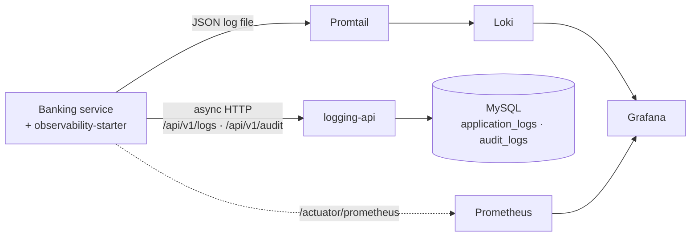

# Bank Observability Platform

A reusable logging, tracing and audit platform for the Bharat Bank microservices.
A Spring Boot service adds one dependency and a few lines of configuration, and
gets structured, masked, correlated application logs and an append-only audit
trail — without writing logging code. Other stacks (NestJS) use the same HTTP
contract.

> **Source of truth:** the code. The documents listed below were corrected
> against it on 2026-09-13, but if they ever disagree with the code, trust the
> code.

## How it works



1. `RequestContextFilter` captures the `X-Trace-Id` (or creates one) and the
   caller's channel, device, customer and IP.
2. `@LogRegistry` on a controller method times it, picks INFO / WARN / ERROR,
   and hands a record to `CommonLogger`. With `audit = true` it also builds an
   audit record.
3. `CommonLogger` masks sensitive values, adds bank, environment, service and
   timestamp, writes a JSON line to `logs/{service}.log`, and queues the record.
4. A background worker posts it to `logging-api`, which validates it and stores
   it. Audit rows are append-only and hash-chained.
5. Logging never blocks or fails the banking request: bounded queue, short
   timeouts, failures counted in `observability_logs_*` metrics.

## Modules

| Folder | What it is |
|---|---|
| `observability-contract/` | The wire DTOs shared by producer and consumer (`LogIngestRequest`, `AuditIngestRequest`, `ApiResponse`) — no Spring |
| `observability-starter/` | The Spring Boot starter every service imports: filter, `@LogRegistry` aspect, masking, `CommonLogger`, async HTTP sink, trace propagation |
| `logging-api/` | Service on `:8090` that validates, stores and searches logs and audit records (MySQL, Flyway) |
| `sample-bank-app/` | Mock bank on `:8080` with five PRD journeys and a stub CBS, used to exercise the platform |
| `infrastructure/` | Docker Compose, Loki, Promtail, Prometheus, Grafana provisioning, MySQL bootstrap, `smoke-test.sh` |

## Quick start (local, verified)

Prerequisites: JDK 21, Maven, MySQL 8 with the `observability` database and
user created by `infrastructure/mysql-init.sql` (it also sets
`log_bin_trust_function_creators`, which the audit triggers need).

```bash
mvn clean install

# from the repository root, in two terminals
java -jar logging-api/target/logging-api-1.0.0-SNAPSHOT.jar         # :8090
java -jar sample-bank-app/target/sample-bank-app-1.0.0-SNAPSHOT.jar # :8080

curl -H "X-Trace-Id: MY-TEST-001" -H "X-Customer-Id: CIF-99001" \
  http://localhost:8080/api/v1/accounts/918273645510/balance

curl http://localhost:8090/api/v1/logs/MY-TEST-001
```

The Docker Compose route (`cd infrastructure && docker compose up -d --build`)
runs the whole stack including Loki and Grafana, but has not been run yet.
Step-by-step instructions, test journeys and troubleshooting: **`RUN.md`**.

## Using it in a Spring Boot service

```xml
<dependency>
    <groupId>com.npst.observability</groupId>
    <artifactId>observability-starter</artifactId>
    <version>1.0.0-SNAPSHOT</version>
</dependency>
```

```yaml
observability:
  environment: ${OBSERVABILITY_ENVIRONMENT:DEV}
  bank:
    code: ${OBSERVABILITY_BANK_CODE:NPST}
  sink:
    endpoint: ${OBSERVABILITY_LOGGING_ENDPOINT}
    audit-endpoint: ${OBSERVABILITY_AUDIT_ENDPOINT}
```

```xml
<!-- src/main/resources/logback-spring.xml -->
<configuration><include resource="observability-logback.xml"/></configuration>
```

```java
@PostMapping("/imps")
@LogRegistry(action = "FUND_TRANSFER", module = "PAYMENTS", entity = "TRANSFER",
             audit = true, warnOn = InsufficientFundsException.class)
public ResponseEntity<TransferResponse> imps(@Valid @RequestBody TransferRequest request) {
    AuditContext.amount(request.amount(), "INR");
    ...
}
```

Details, caveats (scheduled jobs, mask lists, HTTP clients) and the NestJS
producer: **`INTEGRATION.md`**.

## logging-api endpoints

| Method + path | Purpose |
|---|---|
| `POST /api/v1/logs` | Store one application log |
| `GET /api/v1/logs/{traceId}` | Every stored line of one journey |
| `GET /api/v1/logs?service=&level=&customerId=&channel=&from=&to=` | Search |
| `POST /api/v1/audit` | Append one audit record |
| `GET /api/v1/audit/{traceId}` | Audit records of one journey |
| `GET /api/v1/audit?actorId=&customerId=&action=&businessRef=&from=&to=` | Audit search |
| `GET /swagger-ui.html` | Interactive API docs |

## Status

- **Layer 1 (application logging) and the audit trail:** built; 43 tests;
  end-to-end gate passes locally (Loki check skipped without Docker).
- **Not yet run:** Docker Compose, Promtail, Loki, Grafana, Prometheus.
- **Not built:** authentication on logging-api, error-log persistence (Layer 2),
  a NestJS producer, durable audit delivery.
- **Known gaps** — including masking leaks and audit records that can be lost —
  are tracked in `PROJECT_REVIEW.md`.

## Documentation

| Document | Read it for |
|---|---|
| `LOGGING_PROJECT_LEARNING_GUIDE.md` | A guided, beginner-friendly course through the whole platform |
| `ARCHITECTURE.md` | How every piece works and why it was designed that way |
| `INTEGRATION.md` | Adopting the platform in a Spring Boot or NestJS service |
| `RUN.md` | Running it locally, trying the journeys, troubleshooting |
| `PROJECT_REVIEW.md` | Gaps, open questions, assumptions, recommended order of work |
